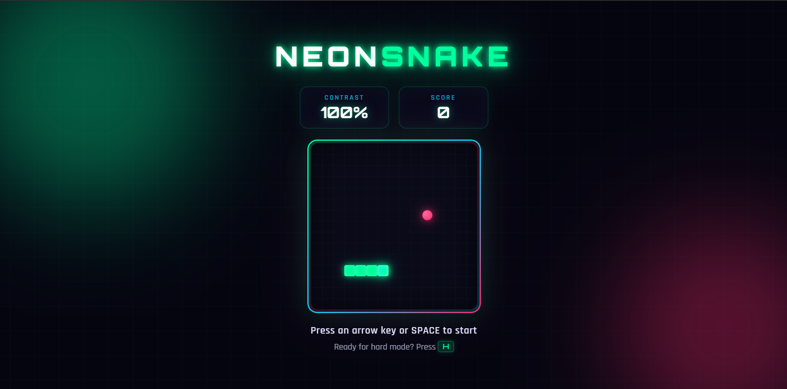

# Neon Snake

    

A modern, visually intense Snake game built with pure HTML, CSS, and vanilla JavaScript.

**Fully playable on mobile** with swipe gestures and mode selection modals.

---

## Play Online

[Click here](https://souravbanerjeedata.github.io/snake-game-in-javascript/)

---

## Features

- Smooth sliding animations
- Contrast fading mechanic
- Hard Mode & Easy Mode
- Neon visual design
- **Mobile experience**
  - Mode selection modal on start (Easy / Hard)
  - Swipe to control the snake
  - Game over modal with “Play Again”
- Responsive layout
- Keyboard controls on desktop

---

## How to Play

### Mobile

1. Choose **EASY** or **HARD** in the opening modal
2. **Swipe** in any direction to start and control the snake
3. When the game ends, tap **PLAY AGAIN** to return to mode selection

### Desktop

| Key        | Action           |
| ---------- | ---------------- |
| Arrow keys | Move / Start     |
| Space      | Restart          |
| H / E      | Hard / Easy mode |

---

## Author

**Sourav Banerjee**  
GitHub: [Souravbanerjeedata](https://github.com/Souravbanerjeedata)
